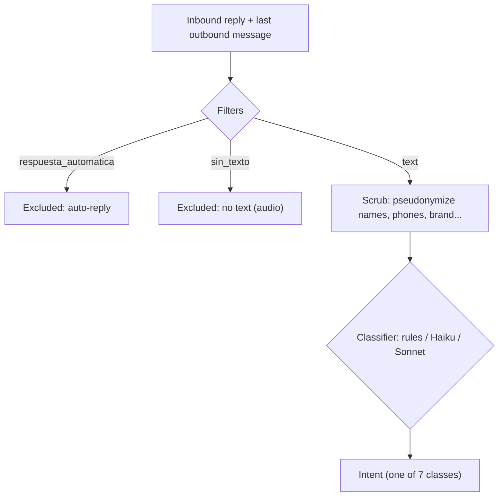

# reply-intent-classifier

Sales teams get short WhatsApp replies to their automated follow-ups, and each reply has to
reach someone who can act on it. This repo classifies every reply into one of 7 intents (call
me, write to me, send information, not interested, and so on) and compares a rule baseline
with two Claude models. The reference labels were generated by Claude Opus 5.5, and **0 of them
were verified by a person**, so every number is agreement with those labels, not accuracy.
**Result:** both models agree with the reference labels far more often than the rules (Claude
Haiku 4.5: 93.9 %, Claude Sonnet 5: 97.6 %, rules: 71.3 %; n = 164) and make far fewer costly
errors (4 and 2, against 17). The cheaper model, Haiku, trails Sonnet by 3.7 points, which
is within the noise at this sample size.

## My role

I did this work with Claude Code as my coding agent. My part: I wrote the labeling guide and its
priority rule, designed the pseudonymization with a test that fails when each layer is switched
off, built the rule baseline, and defined the evaluation (agreement, bootstrap confidence
intervals, macro-F1 and a cost matrix for costly errors) and the decision. Claude Code wrote code
to those specifications, and I reviewed every result.

**Question: Claude Haiku 4.5 vs Claude Sonnet 5 vs a rule baseline — how much is lost with the
cheaper model, and in which errors?**

> **Scope and caveats**
> - **The reference labels were generated by Claude Opus 5.5 (`claude-opus-5-5`). 0 rows were
>   verified by a person.** Every number here is agreement with those labels, not accuracy.
> - **The results come from Claude Code sub-agents with a pinned model, not from
>   `classifier/llm.py`.** `llm.py` is the publishable API classifier; it was **not run against
>   the API** in this evaluation.
> - **Cost and latency were not measured.**
> - **Every model involved is Claude**, the same family as the labeler.
> - **n = 164** real replies. **5 audio replies with no text are left out.**
> - **No customer text is published.** The repo carries the labels and structural variables
>   (`data/replies.csv`) and a synthetic set of 70 invented replies (`data/synthetic.py`). The
>   maximum similarity of any synthetic reply to a real one is **0.69**.

## Problem

People answer automated follow-ups with short, messy replies: they ask for the price, give a
time to call, ask to be written to instead, say no, or send a thumbs-up. The classifier assigns
**one intent per reply**. When a reply fits two classes, a written priority rule decides:

`fuera_de_tema` > `no_interesado` (+ explicit opt-out flag) > `prefiere_escrito` >
`quiere_contacto` > `pospone` > `pide_informacion` > `sin_intencion`

The definitions, edge cases and invented examples are in `data/LABELING_GUIDE.md`
(v2, SHA-256 `fbf4d505…`).



| Class (as in the code) | Meaning | Intended action |
|---|---|---|
| `pide_informacion` | asks about the product, price, method or location | answer the question in writing |
| `quiere_contacto` | wants to be called or contacted, or gives a time | call |
| `prefiere_escrito` | explicitly refuses calls, or only states a channel preference | write, do not call |
| `pospone` | postpones without refusing and without a set time | follow up later |
| `no_interesado` | declines the offer | stop offering; contact is still allowed |
| `no_interesado` + explicit opt-out flag | declines and asks not to be contacted again | stop all contact |
| `sin_intencion` | nothing actionable: a greeting, "ok", an emoji | no action |
| `fuera_de_tema` | not addressed to this business: wrong chat, or another business | no action |

**This repo classifies; it does not act.** The actions are the intended use of each intent.
`no_interesado` without the opt-out flag means the person declined the offer but did not ask to
stop all contact (see `data/LABELING_GUIDE.md`).

## Data and label provenance

- **Real set:** 164 labelable replies from one month (August 2026), pseudonymized.
  - From 182 rows: 7 duplicates removed, 6 auto-replies and 5 audio messages filtered out.
  - Pseudonymization: `data/prepare.py`. Every layer is covered by a test that fails when the
    layer is switched off.
  - **The text stays private.** `data/replies.csv` has only ids, structural variables, the
    label and `label_source`.
- **Reference labels:** Claude Opus 5.5, confirmed for all 7 labeling sub-agents from the
  model recorded by Claude Code.
  - Two independent passes plus an adjudicator, following guide v2.
  - Agreement between the passes: 99.4 %, κ 0.993.
  - A third fresh pass on a random 30-row sample agreed 30/30.
  - **Rows verified by a person: 0.**
  - Details: `data/LABELING_PROVENANCE.md`.
- **Synthetic set (public):** 70 invented replies with the same class mix, written from the
  guide, labeled `synthetic`. It is the part anyone can re-run. Similarity report:
  `data/synthetic_similarity.txt`.

## Results (real set, n = 164)

| Classifier | Agreement with Claude labels (95 % CI) | Macro-F1 | Costly errors | Stability (30 rows re-run) |
|---|---|---|---|---|
| Rules (`baseline/rules.py`) | 71.3 % (64.0–78.0) | 0.68 | 17 | deterministic |
| Claude Haiku 4.5 (ran as `claude-haiku-4-5-20251001`) | 93.9 % (90.2–97.6) | 0.95 | 4 | 1 / 30 changed |
| Claude Sonnet 5 (ran as `claude-sonnet-5`) | 97.6 % (95.1–99.4) | 0.98 | 2 | 0 / 30 changed |

**Self-consistency ceiling, not an evaluated model:** the labeler's own v2 pass B agrees
99.4 % with the reconciled labels. Details are in `eval/results.md`.

**How it ran:**
- Each classifier was a set of Claude Code sub-agents with a pinned model.
- Each sub-agent got exactly the `llm.py` prompt and input, in batches of at most 20 rows in
  fixed-seed order, and returned JSON validated like `llm.py`.
- Effort, thinking and temperature were sub-agent defaults: **not controlled**.

**What the numbers say:**
- **Both models are far above the rules.**
- **Haiku trails Sonnet by 3.7 points, with overlapping intervals.**
- **Neither model misses a contact request or an explicit opt-out.**
- Haiku would call 2 people who asked to be written to.
- Both leave the same 2 questions unanswered.

**Costly errors** (called `EXPENSIVE` in `eval/run_eval.py`; listed in `eval/results.md`)
are a contact request ignored, a missed opt-out, a call to someone who asked to be written to,
or a question left unanswered.

**Synthetic set (n = 70):** Haiku 100 %. The rules' 100 % is **not comparable**, because they
were tuned on this set. Sonnet was not run on it.

## Decision

`DECISION.md`: **closed on quality only. On quality, Claude Sonnet 5.**
- **Haiku is not ruled out:** its gap to Sonnet is within the noise at n = 164.
- **If the cost per message measured through the API clearly favours Haiku, Haiku becomes the
  choice.**
- **The rules do not go to production.**

## Limitations

- **The labels are Claude Opus 5.5's**, and 0 rows were verified by a person. Agreement
  measures consistency with those labels, not correctness.
- **Circularity:** all models are Claude. Haiku and Sonnet are different models from the
  labeler, but shared biases can still inflate their agreement.
- **Sub-agents, not the API:** effort and sampling were not controlled, and cost and latency
  were not measured. `llm.py` may give different numbers when run through the API.
- **n = 164**, one month, one company.
- **5 audio replies have no text** and are not classified.
- **The rules were tuned on the synthetic set.**

## A bug worth telling (PR #65)

While building the human-escalation path, I added an acknowledgement for no-show leads who
replied. **The CRM already acknowledged every inbound message**, so a replying lead
received two near-identical messages a second apart.

It was worse than a duplicate. The existing acknowledgement had a guard against repeating
itself, and the new message counted as "already answered". The better message, the one that
greets the person by name and says who their advisor is, got suppressed by the generic one.

**No test or metric caught it**, because they tested my new code, not the system's behaviour
on an inbound message. I found it while reading a lead's conversation for another reason. My
fix (PR #65) removed the duplicate. The lesson became one of my working rules: **before adding a
behaviour, read what the system already does at that point.**

## Next steps

1. **Break the circularity:** evaluate a local open-weights model (not Claude) with the same
   prompt against the same labels.
2. **Measure cost and latency through the API:** run `classifier/llm.py` with Haiku and
   Sonnet. Public list prices are kept in `config/pricing.json` for that future measurement.
   They are a reference only, not a cost estimate for this classifier.

## How to run

Tested with **Python 3.13.2**. The tests need `pytest`; everything else is the standard library.
The `anthropic` package and an API key are needed **only** for the API path, which was not run.

```bash
python -m pip install pytest
python -m pytest -q                                          # 72 tests, synthetic data and a mocked API
python tests/capas_apagadas.py                               # switches each pseudonymization layer off
python eval/run_eval.py run --model rules --set synthetic    # rules on the public synthetic set
python eval/run_eval.py report                               # rebuilds eval/results.md from eval/metrics/
```

`run` and `report` write into `eval/metrics/` and `eval/results.md`. Re-running them on this
repo gives the same files. To write somewhere else, add `--out <folder>` to both: metrics and
`results.md` then go to that folder, and the repo is left untouched.

**Needs the API (not run here):** `python eval/run_eval.py run --model haiku --set synthetic`
and the same with `--model sonnet`. They need `pip install anthropic` and `ANTHROPIC_API_KEY`.
The real set cannot be re-run from this repo, because its text is private.

## Layout

| Path | What |
|---|---|
| `data/replies.csv` | public dataset: ids, structural variables, Claude labels, `label_source`; no text |
| `data/LABELING_GUIDE.md`, `data/LABELING_GUIDE_CHANGELOG.md` | guide v2 and its history |
| `data/LABELING_PROVENANCE.md` | who labeled, how, agreement, limitations |
| `data/prepare.py` | pseudonymization; the brand list and name dictionary are inputs **outside** the repo |
| `data/synthetic.py`, `data/synthetic_similarity.txt` | public synthetic set and its similarity check |
| `config/pricing.json` | public list prices with source and date, read by `eval/run_eval.py` for a future cost measurement. **List prices, not a measured cost** |
| `baseline/rules.py` | rule baseline (tuning log in `ADJUSTMENTS`) |
| `classifier/llm.py` | the publishable API classifier (not run against the API in this evaluation) |
| `eval/subagent_batch.py` | batch plan and prompt printer for the sub-agent evaluation; validates their JSON |
| `eval/run_eval.py`, `eval/results_md.py`, `eval/results.md`, `eval/metrics/` | metrics, bootstrap CIs, error cost; the results |
| `tests/` | synthetic data and a mocked API; `tests/capas_apagadas.py` switches layers off one by one |
